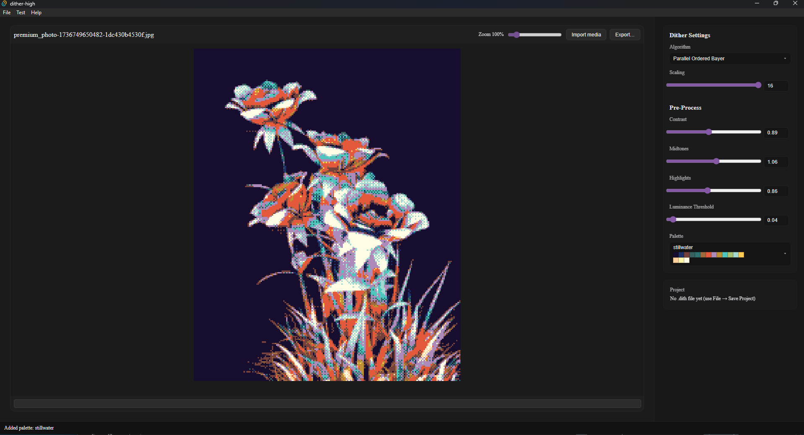
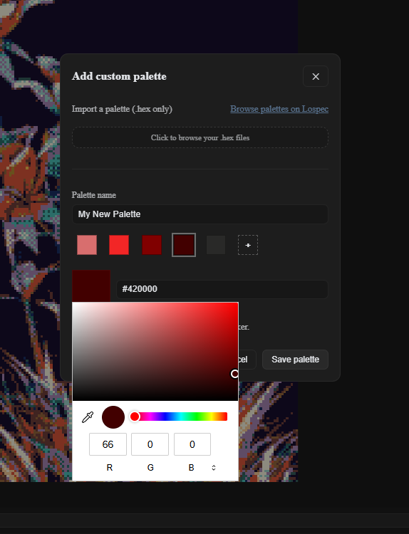

# Dither High (Preview)

> A visual preview of a free desktop dither studio for expressive images and video.

  
  

<em>Image processing workspace and custom palette editor.</em>

## What is dithering?

Dithering uses a limited color palette and intentionally arranged pixels to describe gradients, texture, and detail. It gives digital images a distinct graphic character and opens a large design space through algorithm, palette, scale, and preprocessing choices.

## Why Dither High?

Dither High makes creative dithering easy and free, with a responsive desktop workflow for still images and video. The project focuses on highly controllable settings, clear previews, and high-quality export settings that respect fine dither patterns across a video sequence.

## Creative toolkit

- Import images or video, explore a live dither preview, and save reusable `.dith` projects.
- Choose ordered Bayer, parallel ordered Bayer, Floyd-Steinberg, X-modulated error diffusion, Y-modulated error diffusion, and Voronoi diffusion.
- Tune scale, contrast, midtones, highlights, and luminance threshold before the dither stage.
- Export images plus video in compatible MP4, dither-safe MP4, or WebM formats. Video exports support shimmer reduction, motion-aware stabilization, progress reporting, chunk processing, and audio remuxing.
- Build palettes color by color, derive palettes from source media, or import hexadecimal palette files exported by the [Lospec Palette List](https://lospec.com/palette-list/). Source extraction uses deterministic histogram analysis and OKLab-aware greedy color selection.
- Add an ASCII layer that maps each dither-grid pixel to a glyph cell. Custom character sets, font metrics, automatic spacing, and glyph caches support typographic experiments at export time.

## Project architecture

The interface is built with React, TypeScript, and Tauri. It keeps responsive control values, committed project settings, undo history, and preview requests in one coordinated desktop workflow. Tauri commands carry the selected project state to a Rust media layer and return render progress and export events to the interface.

Rust handles image decoding, palette extraction, preprocessing, dithering, ASCII glyph rendering, caching, and export coordination. The rendering sequence follows a shared path of downscale, preprocess, dither, and optional ASCII, giving previews and exports the same visual logic.

Video processing uses FFmpeg and FFprobe for frame extraction, metadata probing, encoding, concatenation, and audio remuxing. Rayon schedules CPU work for video chunks, while shimmer-reduction modes retain chronological frame state for stable dither patterns.

## Built with

React, TypeScript, Vite, Tauri, Rust, Rayon, the Rust `image` crate, FFmpeg, FFprobe, `ab_glyph`, `fontdb`, and Criterion.

## Add more screenshots

Add future examples to [`assets/screenshots`](assets/screenshots/) with names such as `example3.png`, `example4.png`, and beyond. Add each image to the gallery near the top of this README when it is ready to showcase.

This preview repository contains the project overview and gallery assets.
